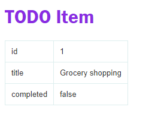

# express-todo

## Стек

* express
* pug

## Запуск

`npm start` - Запуск сервера

## Страницы

`localhost:3002` - Список дел

`localhost:3002/todos/:id` - Задача по id. Вместо :id поставить, например, 1 

## APi

`localhost:3002/api/todos` - json со списком задач 

`localhost:3002/api/todos?completed=true` - json с выполненными/не выполненными задачами

`localhost:3002/api/todos/:id` - json с задачей по id. Вместо :id поставить, например, 1 